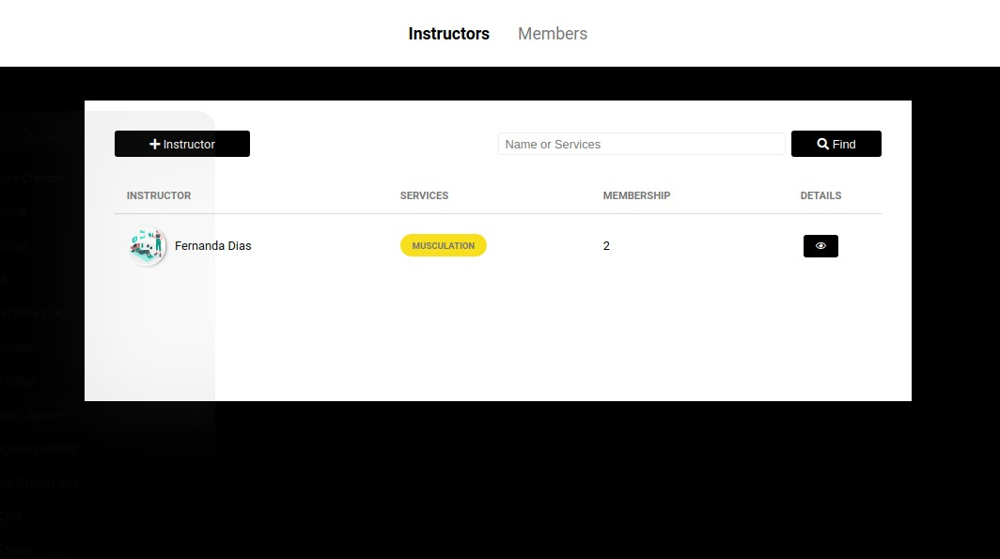
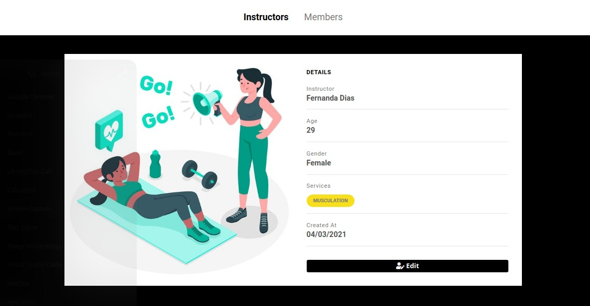
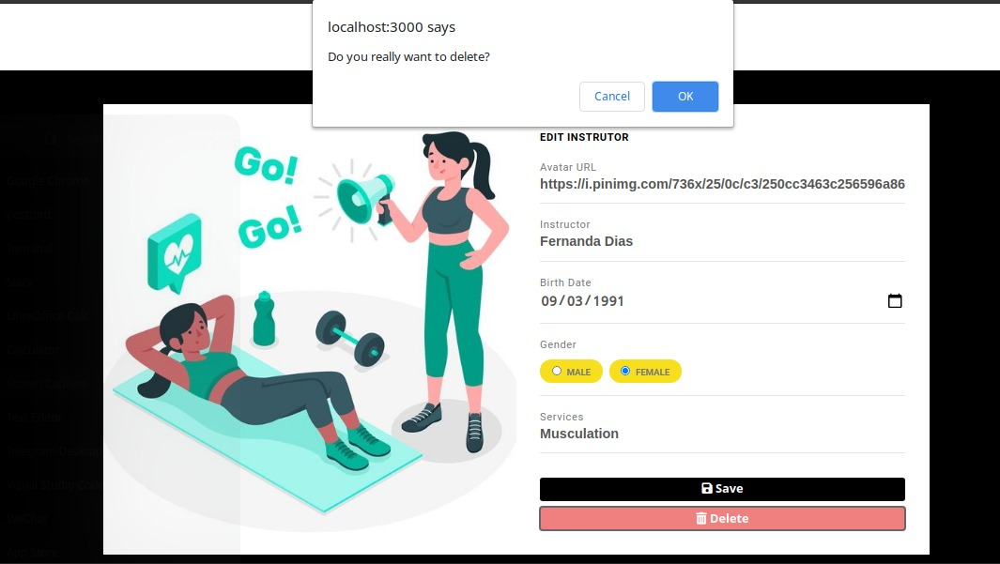

<h1 align="center">
    
</h1>

<h3 align="center">
  Desafio: Control Gym
</h3>

<p align="center">

  <a href="https://rocketseat.com.br">
    
  </a>

  <a href="./LICENSE" >
    
  </a>
  
  <a href="https://www.linkedin.com/in/fernanda-dias-silva/" >
    
  </a>

</p>


<div align="center">
    
    
    
</div>

#### Instalation:

Configure postgres(controlgym/src/config/db.js) with database gymmanager and tables: instructors and members. 

Run on terminal:

```bash
npm install
```

#### Run:
```bash
npm start
```
## License

This project is under the MIT license. See the archiv [LICENSE](./LICENSE) for more details.

## Special Thanks
I just want to thank you [Rocketseat](https://rocketseat.com.br) for this awesome opportunity to learn more about those technologies. This module was really amazing and I've learned a lot!